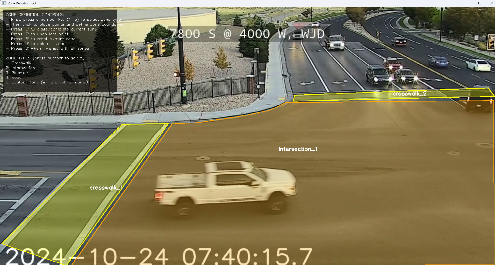
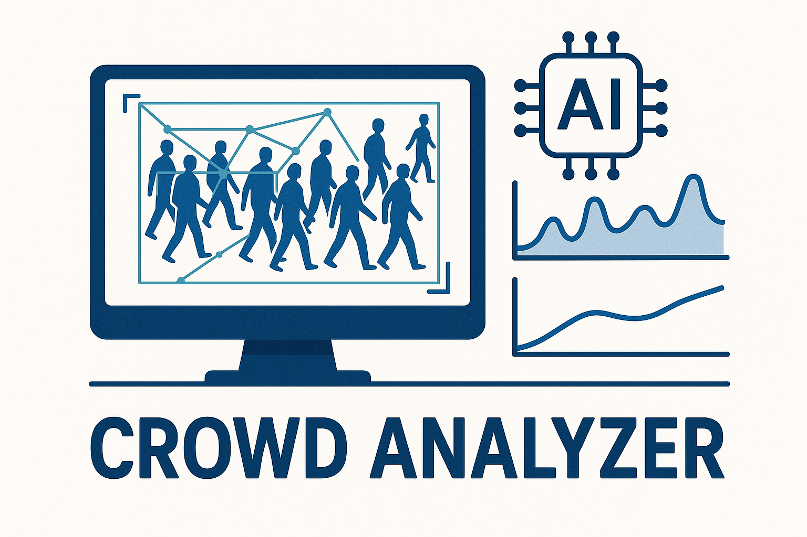

# 🚶‍♂️ CrowdSense
<video src="https://github.com/Yash-Codez/CrowdSense/blob/main/video/Sample_1080.mp4"></video>
CrowdSense is a Python-based intelligent system for analyzing pedestrian and vehicle movements using state-of-the-art computer vision and machine learning techniques. Designed for traffic insights, safety analytics, and smart city applications, it features real-time object tracking, zone-based behavior analysis, and advanced visualization — all powered through a sleek graphical interface.

---

## 🎉 What's New (April 2025)

✅ **Smart Intersection Tracking**  
✅ **Custom Zone Definition (sidewalks, crosswalks, etc.)**  
✅ **Vehicle-Pedestrian Interaction Detection**  
✅ **Advanced Homography Calibration for Real-world Scaling**  
✅ **Enhanced Trajectory Mapping & Speed Indicators**  
✅ **Automated Plot Interpretation with Groq’s LlamaVision 90B**  
✅ **Modular Tracking via `tracker_pedv.py`**

---
Enhanced pedestrian tracking visualization with PedV (NEW) 

Advanced analysis interface with zone definition (NEW)

## 🚀 Features

- 🔍 YOLOv8-based Object Detection  
- 🔄 Kalman Filter Multi-Object Tracking  
- 🚦 Co-tracking of Pedestrians and Vehicles  
- 🗺️ Custom Zone-Based Analysis (crosswalks, roads, etc.)  
- 📏 Real-world coordinate transformation via Homography  
- 📈 Density and Speed Estimation (Voronoi & traditional methods)  
- 🧠 AI Analysis of PedPy Plots using LlamaVision via Groq API  
- 🖥️ PyQt6-based Interactive GUI  
- 📂 Exportable Trajectory Data & Zone Reports

---

## 🖥️ GUI Preview

- Load and analyze video in real time  
- Visualize object paths, speed heatmaps, and zone-based metrics  
- View automatic plot interpretations in the analysis panel

> **Screenshots & Demo Videos**
[](https://www.youtube.com/watch?v=8AqZnFtbx6g)

Main application interface

Video processing and tracking visualization

Density, Speed and trajectory analysis plots using Pedpy and LllamaVision
[Density, Speed and trajectory analysis](img/Plot_window.png)

---

## 📦 Installation

```bash
git clone https://github.com/Yash-Codez/CrowdSense.git
cd CrowdSense
python -m venv venv
source venv/bin/activate  # On Windows: venv\Scripts\activate
pip install -r requirements.txt
python CrowdSense.py
